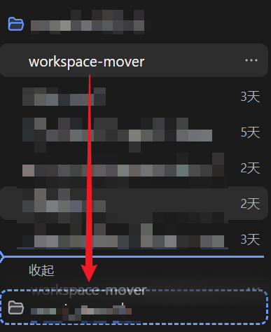
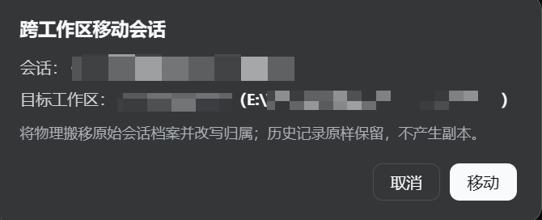
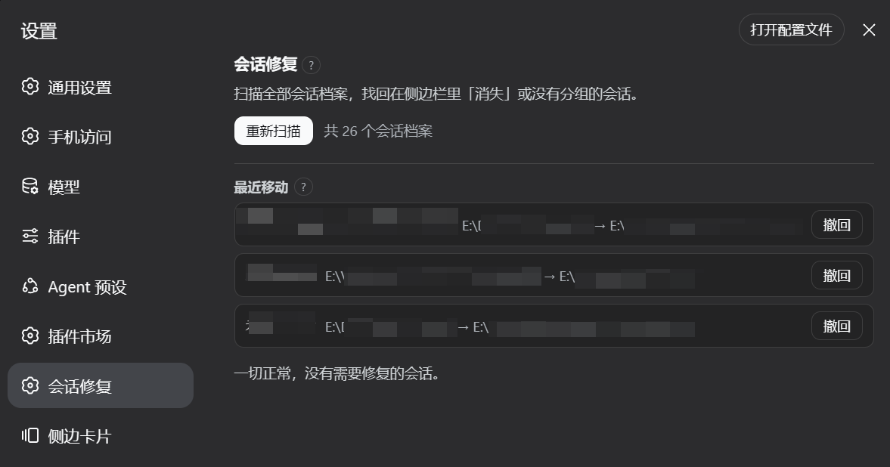
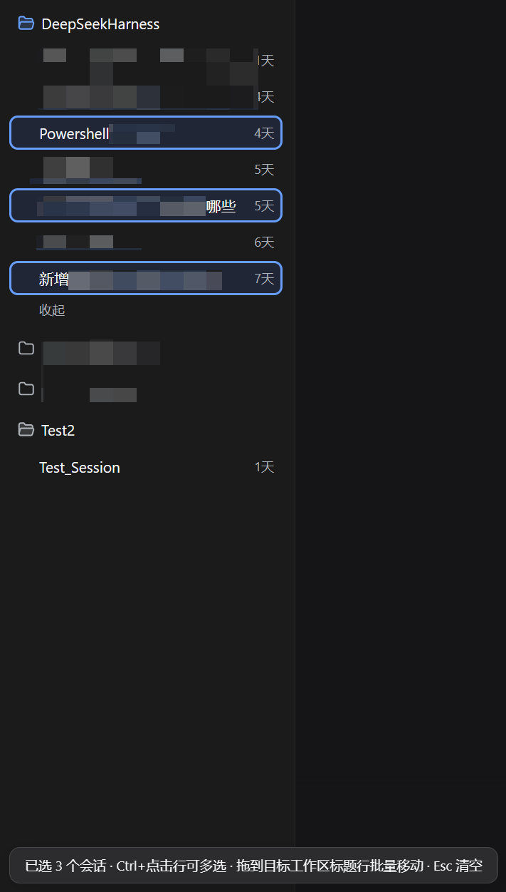
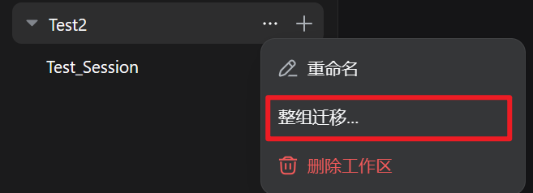
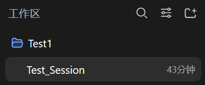
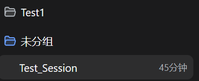
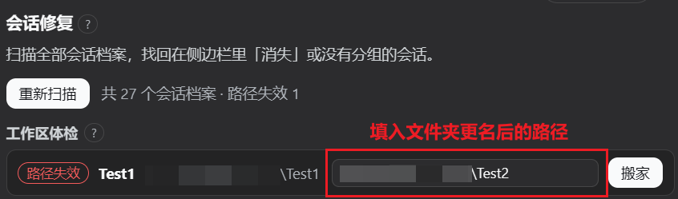
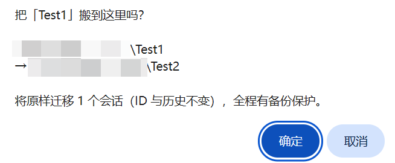
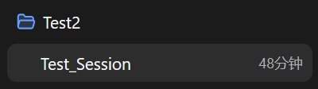

# dsh-workspace-mover

> [!IMPORTANT]
> 非官方项目，由社区成员独立开发和维护。

<!-- Hero -->
<div align="center">
  <b style="font-size: 1.15em;">在侧边栏把会话拖到另一个工作区——真迁移原始档案，而不是复制</b><br /><br />
  <p style="font-size: 0; line-height: 1;">
    <a href="https://github.com/PianoPrince/dsh-workspace-mover/actions/workflows/test.yml"></a>
    <a href="https://www.npmjs.com/package/dsh-workspace-mover"></a>
    
    
    
  </p>
  <p style="font-size: 0; line-height: 1;">
    <a href="https://github.com/PianoPrince/dsh-workspace-mover/stargazers"></a>
    <a href="./LICENSE"></a>
    <a href="https://awesome-dsh-plugin.com"></a>
    <a href="https://www.dsh.so/artifact/dsh-workspace-mover/"></a>
    
    
    
  </p>
  <p style="font-size: 0; line-height: 1;">
    
    <!-- release-downloads-badge:start --><!-- release-downloads-badge:end -->
  </p>
</div>

<div align="center">
  🌏 中文 · <a href="./README_EN.md">English</a>
</div>

## 📑 目录

- [✨ 功能](#-功能)
- [🚀 安装](#-安装)
- [🖼️ 特性巡礼](#️-特性巡礼)
- [⌨️ 使用](#️-使用)
- [🔌 如何接入 DSH](#-如何接入-dsh)
- [🤝 与其他插件共存](#-与其他插件共存)
- [🧩 兼容性与卸载](#-兼容性与卸载)
- [🔐 安全台账](#-安全台账safety-ledger)
- [⚠️ 已知限制](#️-已知限制)
- [🆕 最近版本](#-最近版本)

---

## ✨ 功能

DeepSeek Harness 侧边栏可以拖拽排序**同一工作区**内的会话，但拖到**另一个工作区**上会被静默忽略。本插件补上跨工作区迁移：

- **🖱️ 拖拽迁移**：把空闲会话行拖到目标工作区标题行，确认后完成移动
- **📦 批量迁移 / 分组合并**：Ctrl/Shift 多选后整批拖移，或用组标题「⋯」菜单「整组迁移…」；源分组清空后可一键删除，两条命令完成合并（单批至多 50 个，失败互不牵连）
- **🚚 真迁移 · 零 token**：会话 ID 与完整历史原样保留，不复制副本、不重新注入上下文
- **🏠 工作区搬家向导**：项目文件夹被移动/改名后，一键把失效分组原地重定向到新位置；id、标题、排序、归档位保持，名下会话连同旧路径散件一起迁移
- **🛟 会话救援**（设置 → 会话救援）：一键找回「失联」「未记账」「挂错分组」的会话；已归档会话可恢复；支持一键修复与筛选
- **🗑️ 回收站与备份**：删除先进回收站，可还原到原位置或任意分组；迁移自动生成备份，可按会话恢复或清理
- **🛡️ 数据保护**：回收站与备份的份数/占用一屏可见；「清理 30 天前数据」先预览释放量，确认后执行
- **⏪ 移动历史与撤回**：记录最近 100 次跨工作区移动，批量聚合为一条，整批可一键撤回
- **🧾 迁移任务中心**：批量迁移逐项持久化记录（完成/失败、最后错误与尝试时间），失败项一键重试——按会话当前位置重新迁移，不用陈旧路径
- **📂 空分组清理 / 打开文件夹**：只列出真正零成员的工作区；组菜单可直达系统文件管理器
- **🤖 Agent 工具**：`mover_list_sessions` / `mover_move_session` / `mover_repair_sessions` 三个模型可调用工具——在对话里说「把这个会话挪到某组」即可触发与面板完全相同的备份回滚管线；迁移与修复执行前经宿主审批弹窗确认，未装 dsh-tools 的宿主自动停用

## 🚀 安装

```bash
dsh plugin --profile web add "github:PianoPrince/dsh-workspace-mover"
# 重启 dsh web 一次
```

> **零构建授权**：纯 JavaScript 源码即产物（无 TypeScript、无构建步骤）。从 GitHub 安装时**不需要** `allowBuilds` 构建授权。

<details>
<summary><b>npm 渠道</b></summary>

```bash
dsh plugin --profile web add dsh-workspace-mover
```

</details>

<details>
<summary><b>本地开发安装</b></summary>

```bash
dsh plugin --profile web add "link:C:/path/to/dsh-workspace-mover"
```

</details>

<details>
<summary><b>桌面版安装（DSH v0.2 桌面客户端）</b></summary>

1. 安装并打开官方桌面版，左侧进入「插件」页；
2. 点右上角「添加插件」，搜索 `dsh-workspace-mover` 安装并启用；
3. 完成——桌面 profile 与 web profile 相互独立，需要各自安装一次。

> 桌面 profile 由 Electron 应用专属管理（独立 CLI 不接受 `--profile desktop`），请以应用内插件页为准。

</details>

<details>
<summary><b>常见问题</b></summary>

| 现象 | 原因与解决 |
|---|---|
| 拖了但没反应 | 请在**分组视图**把会话行拖到**工作区标题行**；「扁平列表」视图没有标题行，本插件在该视图不激活 |
| 提示会话正在运行中 | 等该会话回合结束再拖即可 |
| 移动失败的 toast | 操作前有自动备份、失败会回滚；按提示处理后重试。详细原因见宿主日志中的 `MOVE FAILED` |
| 移动成功但侧边栏没归位 | 刷新页面即可 |
| 有些会话从侧边栏不见了 | 打开 **设置 → 会话救援** 自动扫描并找回 |
| 升级 DSH 0.2 后，旧会话切换模型报 `Unknown agent preset` | 0.2 不再读取 0.1.x 旧格式的自定义预设目录，需迁移为声明行——与插件无关，完整步骤见 [docs/dsh-0.2-preset-migration.md](docs/dsh-0.2-preset-migration.md) |

</details>

## 🖼️ 特性巡礼

> 以下均为真实界面实拍（点击可放大）。

### 拖拽跨工作区迁移

| | |
|---|---|
| **把空闲会话行拖到目标工作区标题行，出现虚线高亮** | **确认框亮出目标工作区路径，一键移动** |
|  |  |
| **设置 → 会话救援：一键找回失联与未记账的会话** | |
|  | |

### 批量迁移 · 多选拖拽

| |
|---|
| **Ctrl+点击选中多个会话（当前打开的会话自动带上），左下角亮出计数徽章；拖到目标工作区标题行即整批移动，Esc 清空** |
|  |
| **组标题「⋯」菜单里的「整组迁移…」：整组搬移，迁入后可删除已空的源分组（分组合并）** |
|  |

### 工作区搬家向导 · 实测全程

以下为一次真实搬家的完整记录：把 `Test1` 文件夹改名为 `Test2` 后，用向导原地修复工作区。

| | |
|---|---|
| **改名前：`Test1` 分组正常工作** | **改名后侧边栏仍显示旧分组（磁盘上文件夹已不在）** |
|  |  |
| **打开设置 → 会话修复：「工作区体检」把分组标为「路径失效」，填入新路径** | **确认框亮出起讫路径与将要迁移的会话数** |
|  |  |
| **搬家完成：分组原地更名为 Test2，会话与历史原样保留** | |
|  | |

## ⌨️ 使用

### 拖拽跨工作区迁移

1. 重启后在侧边栏**分组视图**里，按住任意空闲会话行；
2. 拖到目标工作区的标题行（出现虚线高亮）松手；
3. 确认框显示目标工作区路径 → 点「移动」；
4. 完成 toast 提示；若侧边栏未自动刷新，手动刷新页面即可。

运行中的会话会被拒绝；移动失败会自动回滚并在 toast 中说明原因。

### 会话救援面板

1. 重启后打开 **设置 → 会话救援**，面板自动完成首次扫描；
2. **失联**行：选目标工作区 → 点「迁移过去」；
3. **未记账**行：点「补挂账」原地挂到路径匹配的工作区；
4. **挂错分组**行：点「归位」或「全部归位」；
5. **一键修复**：自动跑完可修复项，失败项隔离；
6. 支持按标题 / 会话 ID / 路径 / 分组筛选；
7. **已归档 / 回收站 / 备份**：归档可恢复；删除进回收站，可还原或确认后彻底删除；迁移备份可恢复或清理。

### 对话里迁移（Agent 工具）

1. 装有 `dsh-tools` 的宿主（web 与桌面版默认）自动注册三个模型工具：清单（只读）、迁移、一键修复；
2. 在对话里说「列出我的会话」「把会话 X 挪到 Y 组」「跑一次修复」——模型先用清单工具把名字解析成精确 id，再执行动作；
3. 迁移与修复在动手前经宿主审批弹窗请你确认（与面板确认同级）；拒绝或关闭弹窗则不执行；
4. 宿主没有 `dsh-tools` 时自动停用，不影响面板与拖拽。

### 批量迁移

1. **Ctrl/Cmd+点击**加入多选，**Shift+点击**组内范围选择，**Esc** 清空；
2. 拖任一选中行到目标工作区标题行 →「全部移动」；
3. 或用 **「⋯」菜单 →「整组迁移…」**；源分组清空时可确认后删除（分组合并）。

### 工作区搬家向导

1. 文件夹被移动/改名后，**工作区体检**会把对应分组标为「路径失效」；
2. 填入文件夹现在的完整路径，点「搬家」；
3. 确认起讫路径与会话数量后执行；运行中的会话本次跳过，结束后可续跑剩余部分。

## 🔌 如何接入 DSH

本插件面向使用者只承诺以下接入原则（实现细节见 [docs/ARCHITECTURE.md](docs/ARCHITECTURE.md)）：

1. 使用 DSH **官方扩展点**挂载，不修改 DSH 或 dsh-market 的安装文件；
2. 会话归属变更走宿主提供的**正式接口**，不伪造持久化数据；
3. 插件自有数据（历史、备份、回收站）写在**独立数据目录**，与会话档案分开；
4. 与官方侧边栏同组排序**互不干扰**，只处理跨工作区场景。

## 🤝 与其他插件共存

设计上按「与生态共生」标准实现，冲突面很小：通信与样式使用独立命名空间；不改写官方安装文件；会话归属写入使用宿主正式接口。

| 同装插件类目 | 兼容性 | 说明 |
| --- | --- | --- |
| 官方内置插件（0.2 起的 8 个：终端 / 网页搜索 / 子智能体等） | ✅ 无冲突 | 功能面不相交；Agent 工具经官方 `dsh-tools` 注册表共存，本插件工具名以 `mover_` 前缀隔离 |
| 侧边栏增强 / better-sidebar / 终端 / 费用统计 / 记忆 / 导出分享 | ✅ 无冲突 | 面板与数据面完全不同 |
| 归档管理类插件 | ✅ 兼容 | 双方都使用官方归档数据，数据层一致（面板功能可能有些重复） |
| 回收站 / 会话删除类插件 | ✅ 数据隔离 | 各插件维护独立的回收站目录，互不读写；建议只启用一家的删除入口，避免操作混淆 |
| 排序 / 置顶类插件 | ⚠️ 基本兼容 | 移动后会精确重排「最近更新」；与置顶/排序插件并存通常无碍，仅各自面板展示顺序可能不完全一致 |
| 重画侧边栏的插件（自绘工作区树） | ⚠️ 降级共存 | 对方若替换官方侧边栏结构，本插件可能暂时无法识别会话行——表现为功能不触发，**不会损坏数据** |
| 其他会话移动器 | ❌ 建议二选一 | 同类插件可能重复处理同一次拖拽；本插件已覆盖移动 / 批量 / 合并 / 归位 / 归档恢复 |

## 🧩 兼容性与卸载

### 版本兼容矩阵

| 插件版本 | 已验证 DeepSeek Harness | Node | 备注 |
|----------|-------------------------|------|------|
| 2.1.0 | `0.1.5-rc.1`、`0.1.5-rc.2`、**`0.2.0 桌面版`**（0.2.0-rc.2 内核） | `≥22` | Agent 工具 + 桌面版实测（拖拽迁移、确认框、热重载修复）；宿主缺 `dsh-tools` 时工具自动停用 |
| 2.0.3 | `0.1.5-rc.1`、`0.1.5-rc.2` | `≥22` | 真迁移 / 批量 / 救援 / 回收站 / 备份；首次发布 npm |
| — | `0.2.0 web`（0.2.0-rc.2） | `≥22` | 与桌面版同内核，已按同一代码路径适配；web 启动场景待回归 |

- **engines 声明**：`package.json` → `engines.dsh` ≥ `0.1.5-rc.1`，`engines.node` ≥ `22`（与 CI 矩阵 Node 22/24 一致）。
- **其他已知组合**：dsh-market `1.45.1`。不修改 DSH 源码，仅通过官方扩展点接入。
- **质量门禁**：提交前运行 `npm run check`（语法检查 + 测试 + `npm pack --dry-run`）；CI 在 ubuntu / windows / macos × Node 22/24 上执行同等步骤。
- **市场卡片的「宿主要求未知」**：GitHub-only 插件没有 npm 发布清单时，dsh-market 可能无法从远端元数据推导宿主版本；显示「未知」**不代表**运行时不兼容。
- **升级到 DSH 0.2 的预设迁移**：0.2 不再读取 0.1.x 旧格式的自定义预设目录（`$DSH_HOME\.agent-presets\`），旧会话恢复会报 `Unknown agent preset`（与本插件无关，属宿主变更）。迁移步骤与实测记录见 [docs/dsh-0.2-preset-migration.md](docs/dsh-0.2-preset-migration.md)。
- **卸载可逆**：移除插件不会删除会话档案、工作区或官方记账。插件自己的历史、任务、备份和回收站数据仍保留在插件数据目录（见 [docs/ARCHITECTURE.md](docs/ARCHITECTURE.md)）；移除后刷新或重启 DSH 即可清理注入的界面。
- **共存建议**：不要与另一个跨工作区拖拽移动器同时启用；其他类型插件可按上表共存。

部分高级操作依赖较新的 DSH 能力；不支持时界面会明确提示，而不是静默失败。

## 🔐 安全台账（Safety Ledger）

每一次迁移都走同一条带安全边界的管线：**字节级备份先行 → 逐步回滚 → 迁移后校验 → 恢复账本兜底**。任何一步失败都会回到移动前的状态；连回滚都失败的极端情况会写入持久化恢复记录并在救援面板标红，等待人工确认——数据永不消失。

**Never-does（绝不）：**

- 绝不执行任何 git 写操作（commit / stash / reset / checkout 都不碰）；
- 绝不在字节级备份落盘之前改动任何文件；
- 绝不静默丢弃会话数据——恢复不了的极端情况会明确标红并保留现场；
- 绝不绕过确认执行破坏性操作（对话内的迁移 / 修复还须经宿主审批弹窗）；
- 绝不上传任何本地数据——插件无网络请求，全部工作在本机完成。

**具体承诺：**

- **移动前自动备份**；搬运落地后再核对会话身份与路径，不符则整体回退；
- **失败时恢复到移动前状态**（文件与记账一并恢复）；
- **删除先进回收站**，可还原到原位置或任意分组；彻底删除需二次确认；
- **无法自动恢复时**，会在救援面板明确标出，需要人工确认；会话文件与备份始终保留；
- **近期打开过、仍驻留在 Harness 内存中的会话**不能直接删除，需重启 Harness 后再删（界面会给出明确提示）。

> 失败路径优先保数据，不静默丢会话。<br>
> 并非「任何错误都能自动恢复」：极端情况下会要求人工处理，但数据会留在原处。

## ⚠️ 已知限制

- 不支持把会话移入「Ungrouped」桶；
- 常驻内存的会话（近期打开过）不能直接删除，请重启 Harness 后再删；
- 若第三方插件整页重绘侧边栏，本插件可能暂时无法识别会话行（功能不触发，**不损坏数据**）；
- 「扁平列表」视图无工作区标题行，本插件在该视图不激活；
- 宿主大版本升级若改变内部结构，相关能力可能降级或需重启后生效；搬家向导在无法安全写入时会在改动任何文件之前中止并提示。

## 🆕 最近版本

### v2.1.1 · 2026-10-05

- `mover.doctor` 自检：面板新增「自检」按钮 + `mover_doctor` 模型工具——服务、数据目录、恢复记录、工作区路径约 13 项检查，pass/warn/fail 三态汇报，DSH 升级后先自检再动手
- 信任资产：tagline 下突出 npm 一行安装命令（`dsh://` 深链按钮因 GitHub 剥离自定义协议而移除）、dsh.so 风险徽章（已收录且 L5 实测 / risk low）、dsh-plugin-registry 收录徽章、"DSH tested 0.2.0-rc.2" 徽章
- 兼容性报告：`docs/compatibility/` 落地桌面版实测记录，此后每适配一个 DSH 版本新增带日期报告
- 安全承诺章节品牌化为「安全台账（Safety Ledger）」+ never-does 清单

### v2.1.0 · 2026-10-04

- Agent 工具：`mover_list_sessions`（只读清单）/ `mover_move_session`（迁移单个会话）/ `mover_repair_sessions`（一键修复）注册进官方 `dsh-tools`，在对话里即可调用
- 变更类工具执行前经宿主审批接缝请用户确认：拒绝 / 关闭 / 无应答一律不执行（fail-closed）
- 与面板共用同一条加锁、先备份、迁移后校验的管线；无 `dsh-tools` 宿主自动跳过注册
- 桌面版（0.2）实测通过：修复热重载后「inactive context」移动报错；确认框改为不透明，不再与底层文字重叠
- `mover.status` 新增 `agentTools` 能力位

### v2.0.3 · 2026-09-21

- 首次发布到 npm：`dsh plugin --profile web add dsh-workspace-mover`
- 本地质量门禁 `npm run check`；CI 与之对齐
- README 增加 npm / DSH 徽章与宿主兼容矩阵

完整变更记录见 [CHANGELOG.md](CHANGELOG.md)。<br>
实现与架构说明见 [docs/ARCHITECTURE.md](docs/ARCHITECTURE.md)。

## License

MIT
