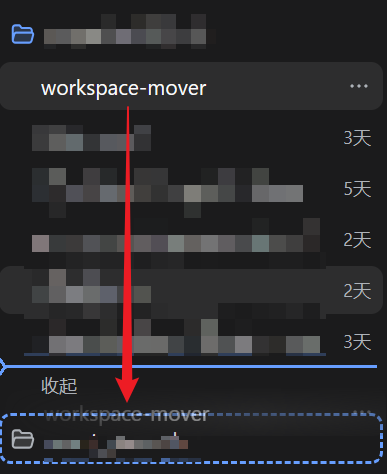
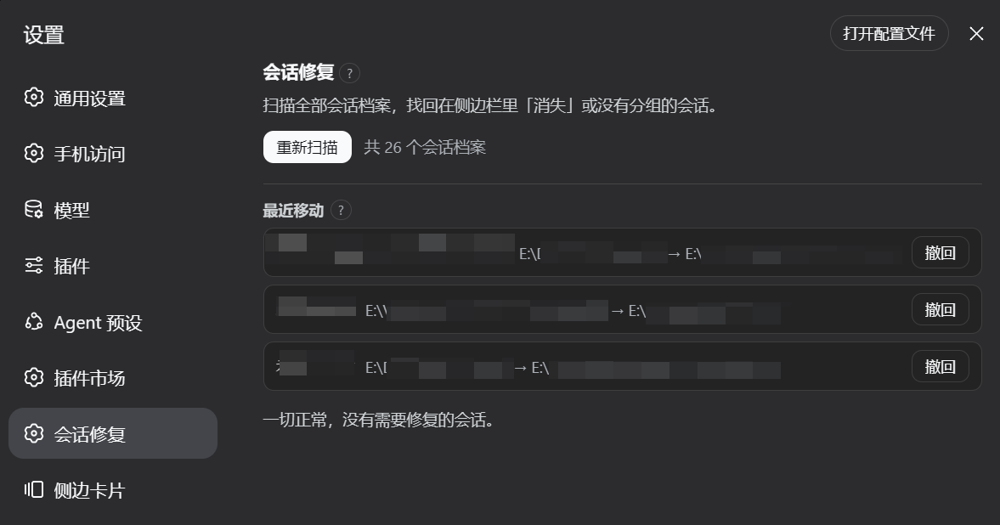
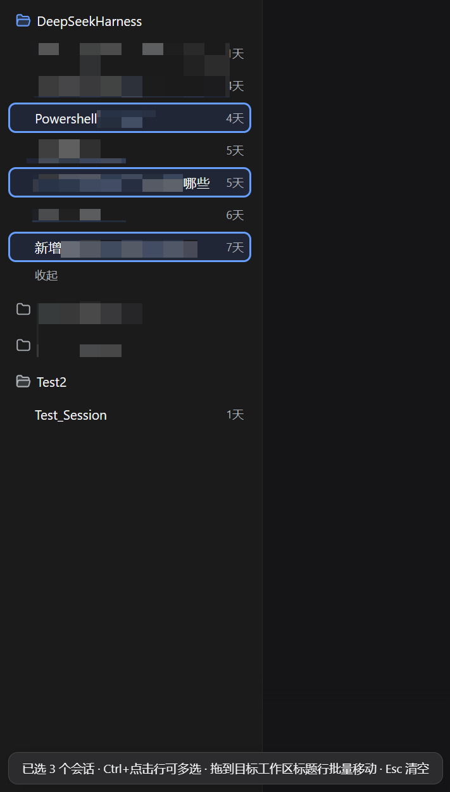
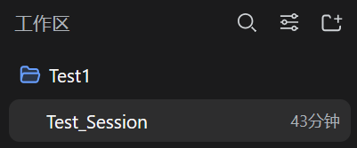
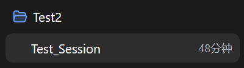

# dsh-workspace-mover

**_> Unofficial project, independently developed and maintained by community members._**

<!-- Hero -->
<div align="center">
  <b style="font-size: 1.15em;">Drag a session onto another workspace in the sidebar—a true move of the original archive, not a copy</b><br /><br />
  <a href="https://github.com/PianoPrince/dsh-workspace-mover/actions/workflows/test.yml"></a>
  <a href="https://github.com/PianoPrince/dsh-workspace-mover/stargazers"></a>
  <a href="./LICENSE"></a>
  
  <br /><br />
  <a href="https://awesome-dsh-plugin.com"></a>
       
</div>

<div align="center">
  🌏 <a href="./README.md"><b>中文</b></a> · English
</div>

<div align="center">
  
</div>

## 📑 Table of Contents

- [✨ Features](#-features)
- [🔬 Technical Notes](#-technical-notes)
- [🚀 Install](#-install)
- [🖼️ Tour](#️-tour)
- [⌨️ Usage](#️-usage)
- [🔌 DSH Integration](#-dsh-integration)
- [🆕 Recent Updates](#-recent-updates)
- [🔐 Security](#-security) · [⚠️ Known Limitations](#️-known-limitations)

---

## ✨ Features

DeepSeek Harness's sidebar supports drag-to-reorder within a workspace, but dropping a session onto **another workspace** is silently ignored—the official RPC only exposes within-workspace `insertSessionBefore` and has no cross-workspace move endpoint. This plugin fills that gap:

- **🖱️ Drag & drop**: Drag any idle session row onto a target workspace title row; a confirmation dialog shows the destination path—one click to move
- **📦 Bulk move**: Ctrl/Shift+click to multi-select rows (plugin-built selection with a live count badge), then drag any picked row to move the whole set; right-click a workspace header to move an entire group. Up to 50 per batch with independent per-session backup/rollback
- **🚚 True move**: Physically relocates the original `session.jsonl.zstd` archive, rewrites the header `cwd`, and updates the workspace registry—the session id and full history are **preserved as-is**, with no duplicates, no context re-injection, and **zero token cost**
- **🏠 Move-home wizard**: After a project folder was moved or renamed on disk, redirect the stale workspace **in place** to its new location with one click—workspace id, title, order and archive flags all preserved; every session under it, including stranded ones on the old path, migrates as-is in one batch. Running sessions skip automatically; an interrupted run resumes with only what remains.
- **🛟 Orphan session rescue** (Settings → "Session Rescue" panel): Scans all session archives on disk and sorts them into—
  - **Orphaned**: sessions whose cwd broke after their project folder was moved/renamed/deleted, so they "disappeared" from the sidebar (community fix for discussion #3012); one click moves them for real into any existing workspace
  - **Unregistered**: sessions with a valid cwd that were never registered by any workspace (bootstrap runs once, agent-internal forks don't register); attach them in place
  - **Ghosts**: ids present in the registry whose archives are missing on disk (read-only notice)
  - All three go through the same backup + rollback pipeline
- **⏪ Move history & undo**: Keeps the last 100 cross-workspace moves; move a session back to its original group from Settings with one click—undo generates its own backup and reuses rollback protection
- **🏷️ Session titles first**: Confirmation dialogs, rescue lists, and recent moves show session titles when available, falling back to "Untitled session"

## 🔬 Technical Notes

1. **Resident-session consistency fix**: Opened sessions keep a frozen header and a persisted write cache in host memory. Moving the files directly would make such a session **write new events back to the old path** on its next turn, forking history—after moving, this plugin clears the stale write state and refreshes registry indexes so the host transparently re-takes over from the new location.
2. **Safety net**: A byte-level backup is forced before every move; if rewriting, relocating, or bookkeeping fails at any step, everything rolls back automatically.
3. **Windows hardening**: Renaming a directory right after a rename inside it can fail transiently with EPERM—retries with exponential backoff, then degrades to copy+delete.
4. **Theme-aware UI**: Confirmations/toasts use only official `--dsw-alias-*` design tokens and follow the appearance setting instantly.
5. **Zero dependencies, no build**: Zero npm dependencies on the host half; the client half ships source-as-product, so there is no build-artifact drift.

## 🚀 Install

```bash
dsh plugin --profile web add "github:PianoPrince/dsh-workspace-mover"
# restart dsh web once
```

> **No build approval needed**: The plugin is pure JavaScript shipped as-is (no TypeScript, no build step), so installing from GitHub does **not** require the `allowBuilds` approval—pnpm executes no install-time scripts.

<details>
<summary><b>npm channel</b></summary>

```bash
dsh plugin --profile web add dsh-workspace-mover
```

</details>

<details>
<summary><b>Local development install</b></summary>

```bash
dsh plugin --profile web add "link:E:/path/to/dsh-workspace-mover"
```

</details>

<details>
<summary><b>FAQ</b></summary>

| Symptom | Cause and fix |
|---|---|
| Nothing happens when dragging | Only dropping a session row onto a **workspace title row** in grouped view triggers a move; flat list view has no title rows and this plugin stays inactive there |
| Toast says the session is running | The host validates turn state; wait for the session's current turn to finish, then drag again |
| Move failed toast | Every move is backed up byte-for-byte beforehand and rolled back on failure; follow the toast guidance and retry—details appear as `MOVE FAILED` entries in the host log |
| Move succeeded but the sidebar didn't settle | The plugin re-fetches the workspace baseline after moving; if it ever fails to settle, reload the page |
| Some sessions vanished from the sidebar | Open **Settings → Session Rescue**; it scans automatically and can recover both orphaned and unregistered sessions in one click |

</details>

## 🖼️ Tour

> Real UI captures (click to enlarge).

### Drag across workspaces

| | |
|---|---|
| **Drag an idle session row onto the target workspace title row; a dashed highlight appears** | **The confirmation dialog shows the destination path—one click to move** |
|  |  |
| **Settings → Session Rescue: recover orphaned and unregistered sessions** | |
|  | |

### Bulk move · multi-select drag

| |
|---|
| **Ctrl+click to pick sessions (the currently open one is included automatically); a count badge appears bottom-left. Drag onto a target workspace title row to move them all; Esc clears** |
|  |

### Move-home wizard · full field run

A complete record of a real repair: the `Test1` folder was renamed to `Test2` on disk, then the wizard restored the workspace in place.

| | |
|---|---|
| **Before: the `Test1` group works normally** | **After the rename the sidebar still shows the old group (folder gone from disk)** |
|  |  |
| **Settings → Session Repair: health check flags the group, type the new path** | **The confirmation dialog shows old → new path and how many sessions will migrate** |
|  |  |
| **Done: the group is renamed Test2 in place; sessions and history intact** | |
|  | |

## ⌨️ Usage

### Drag across workspaces

1. After restarting, hold any idle session row in the sidebar's **grouped view**;
2. Drop it on the target workspace's title row (a dashed highlight appears);
3. The confirmation dialog shows the target path → click "Move";
4. A toast confirms completion; if the host broadcast doesn't trigger a refresh, reload the page manually.

Running sessions are rejected (host-side validation), and failed moves roll back automatically with the reason shown in a toast.

### Session rescue panel

1. After restarting, open **Settings → Session Rescue**; the panel scans automatically;
2. **Orphaned** rows: pick a target workspace → click "Move here" (true move, id preserved);
3. **Unregistered** rows: click "Attach" to register them with the workspace matching their path;
4. Every operation is bracketed by backup and rollback protection, with immediate feedback.

### Bulk move

1. **Ctrl/Cmd+click** sidebar rows to toggle selection (**Shift+click** extends within a group); a corner badge tracks the count, **Esc** clears;
2. Drag any picked row onto the target workspace title row; the confirmation shows the batch size → click "Move all";
3. Or **right-click a workspace header** and pick a target group to move the whole group;
4. Every session is backed up and rolled back independently—one failure (e.g. running) never blocks the rest; the toast summarizes moved vs skipped.

### Move-home wizard

1. Once a folder was moved or renamed, the **Workspace health** block at the top of the panel flags the matching group as missing;
2. Type the folder's current full path into that row's input and press "Move home";
3. The confirmation dialog shows old path → new path plus how many sessions will migrate; confirm to run;
4. Accounted sessions travel over together with stranded strays from the old path. Running sessions skip this round — repeat later with the same inputs to pick up only what remains.

## 🔌 DSH Integration

- **Host half** (`lib/index.js`, zero npm deps): mounted via a standard `insert` row in `cordis.patch.yml`; registers a logical channel through `ctx.connection.rpc.handle('/workspace-mover', …)` with endpoints `mover.status / mover.workspaces / mover.move / mover.moveMany / mover.scan / mover.repair / mover.history / mover.undo / mover.ws.audit / mover.repoint`; failure details land in the host log (`MOVE FAILED`).
- **Move algorithm**:
  1. Running-state check: only sessions mid-turn are rejected (`agents.get(id)?.status === 'running'`, same predicate as the host UI's badge); sessions resident in memory but idle may be moved;
  2. Reads the authoritative session header from disk and verifies target ≠ source;
  3. Byte-level backup into `$DSH_HOME/workspace-mover/backups/` (rolling 20 per session);
  4. Rewrites only the first frame (header cwd) and keeps all other frames intact; published via temp file + atomic rename;
  5. Moves the session directory wholesale (Windows dir-rename quirk: exponential-backoff retries, falling back to copy+delete);
  6. In-memory consistency closeout: invalidates three registry indexes; resident sessions additionally get stale write state cleared, indexes refreshed, and target bookkeeping pre-seeded (bypassing the frozen header's old-cwd check);
  7. Calls the target entity's `attachSession` to persist bookkeeping, after the source entity has already detached;
  8. Any failing step rolls back automatically: unseed bookkeeping → restore index snapshots → return the original to its source directory → reattach to the source workspace.
- **Client half** (`client/client.js`, build-free source-as-product): locates rows purely by ARIA semantic attributes (session rows `[aria-selected]`, workspace title rows `[aria-expanded]`) and never touches CSS-module hash class names; it intercepts only cross-group drops, leaving official same-group sorting untouched. After a successful move it re-fetches the workspace baseline once via public API so the sidebar settles immediately.
- **Rescue panel**: registers a settings-page column through the official `settings.section` slot, using RPC endpoints `mover.scan` (classified scan) and `mover.repair` (batched attach/relink, where relink reuses the same move pipeline).
- **Move history**: stored at `$DSH_HOME/workspace-mover/history.json`, capped at the last 100 entries; undo goes straight back while the original workspace still exists, otherwise you are asked to choose a new target group explicitly.

## 🆕 Recent Updates

### v0.6.3 · 2026-08-28

- Sessions settle into their exact "Recently updated" position automatically after a move — no need to toggle the sort option
- Row-to-session identification now reads the session id carried by the row element itself: hidden and archived members never affect multi-select or move accuracy
- New field screenshot of bulk multi-select

### v0.6.2 · 2026-08-28

- Undo / attach / relink in the settings panel refresh the sidebar immediately, so sessions land in their target group at once
- Starting a multi-select with Ctrl+click automatically includes the currently open session: with A open, Ctrl+clicking B selects {A, B} in one step

### v0.6.1 · 2026-08-28

- Bulk moves aggregate into a single "Recent moves" entry and undo the whole set in one click
- A plain click on a session row leaves multi-select; Esc clears it at any time

### v0.6.0 · 2026-08-28

- Bulk move: plugin-built sidebar multi-select (Ctrl/Shift+click, Esc to clear, count badge) — drag any picked row to move the whole set; right-click a workspace header to move an entire group
- New `mover.moveMany` endpoint: up to 50 per batch, reusing the single-move pipeline — independent per-session backup/rollback, error isolation, and move history entries (undoable)
- Tests 27 → 30 cases

### v0.5.1 · 2026-08-27

- Move-home syncs the workspace title to the new folder name (custom titles are kept)
- After a move, `@` file references point at the new location immediately — no restart needed
- Cold starts keep serving cached session titles, so lists stay stable
- Tests 24 → 27 cases

### v0.5.0 · 2026-08-27

- Move-home wizard: the health panel flags groups whose folder went missing; one click re-points the stale workspace in place—workspace id, title, order and archive flags all preserved—through the entity's unified `mutate` channel (registry indexes pre-seeded first so no member is pruned)
- Batch migration of member sessions plus stranded strays from the old path: per-file backup/rollback and resident write-state cleanup; running sessions skip automatically and interrupted runs resume with the same inputs
- New endpoints `mover.ws.audit` / `mover.repoint` (18 → 24 cases)

### v0.4.0 · 2026-08-26

- Move history and one-click undo: keeps the last 100 cross-workspace moves (`mover.history` / `mover.undo` endpoints), moves sessions back to their original group from Settings, with undo covered by the same backup and rollback protection
- Confirmation dialogs, rescue lists, and move records now prefer session titles

### v0.3.2

- Orphan session rescue: full-disk scan, true migration for orphaned sessions, in-place attachment for unregistered ones—all protected by rollback

## 🔐 Security

- Forced backup before every move; automatic rollback if attaching fails (unseed bookkeeping → restore index snapshot → restore bytes + clean target → reattach to the source workspace);
- Only sessions mid-turn are rejected by default; idle resident sessions get their write-path ownership fixed after moving, preventing history forks;
- All registry/persistence internals are wrapped in try/catch—on failure the plugin degrades to functional-with-a-restart-hint instead of breaking;
- Compatibility targets: Node ≥ 22, dsh 0.1.1-rc.2; core pure functions and end-to-end sandbox tests ship via `npm test` (30 cases covering rollback paths, rescue scan/repair, history undo, and workspace repoint).

## ⚠️ Known Limitations

- Moving sessions into the "Ungrouped" bucket is not supported;
- The target-row ↔ workspace mapping relies on render order aligned with `workspace.list`; if a third-party plugin reorders the sidebar structure, refresh before dragging;
- Flat list view has no workspace title rows, so the plugin stays inactive there;
- If a host upgrade changes registry cache field names or entity shapes, affected steps degrade gracefully (the feature still works; ownership refresh may need a restart).

## License

MIT
