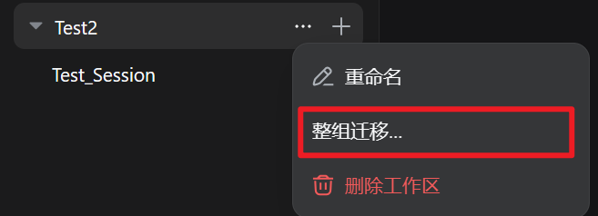

# dsh-workspace-mover

**_> Unofficial project, independently developed and maintained by community members._**

<!-- Hero -->
<div align="center">
  <b style="font-size: 1.15em;">Drag a session onto another workspace in the sidebar—a true move of the original archive, not a copy</b><br /><br />
  <p style="font-size: 0; line-height: 1;">
    <a href="https://github.com/PianoPrince/dsh-workspace-mover/actions/workflows/test.yml"></a>
    <a href="https://github.com/PianoPrince/dsh-workspace-mover/stargazers"></a>
    <a href="./LICENSE"></a>
    
    
    <a href="https://awesome-dsh-plugin.com"></a>
  </p>
  <p style="font-size: 0; line-height: 1;">
    
    
    
    
    <!-- release-downloads-badge:start --><!-- release-downloads-badge:end -->
  </p>
</div>

<div align="center">
  🌏 <a href="./README.md"><b>中文</b></a> · English
</div>

## 📑 Table of Contents

- [✨ Features](#-features)
- [🚀 Install](#-install)
- [🖼️ Tour](#️-tour)
- [⌨️ Usage](#️-usage)
- [🔌 How it integrates with DSH](#-how-it-integrates-with-dsh)
- [🤝 Coexistence with other plugins](#-coexistence-with-other-plugins)
- [🧩 Compatibility and uninstall](#-compatibility-and-uninstall)
- [🔐 Security guarantees](#-security-guarantees)
- [⚠️ Known limitations](#️-known-limitations)
- [🆕 Recent version](#-recent-version)

---

## ✨ Features

DeepSeek Harness's sidebar supports drag-to-reorder **within** a workspace, but dropping a session onto **another workspace** is silently ignored. This plugin adds cross-workspace migration:

- **🖱️ Drag-and-drop move**: drag an idle session row onto a target workspace title row and confirm
- **📦 Bulk move / group merge**: multi-select with Ctrl/Shift and drag the set, or use a workspace header's "⋯" → "Move whole group…"; an emptied source group can be deleted in one confirmation (up to 50 per batch, failures isolated)
- **🚚 True move · zero tokens**: session id and full history are preserved as-is — no duplicates, no context re-injection
- **🏠 Move-home wizard**: after a project folder was moved or renamed, re-point the broken workspace in place; id, title, order, and archive flags stay, and member sessions plus strays migrate together
- **🛟 Session rescue** (Settings → Session Rescue): recover lost / unregistered / misfiled sessions; restore archived sessions; one-click repair and filtering
- **🗑️ Recycle bin and backups**: deletes go to the recycle bin first and can be restored; every move creates a backup you can restore or clean up
- **⏪ Move history and undo**: last 100 cross-workspace moves; bulk operations aggregate into one undoable entry
- **📂 Empty-group cleanup / open folder**: only truly empty workspaces are listed; open a group directory in your file manager

## 🚀 Install

```bash
dsh plugin --profile web add "github:PianoPrince/dsh-workspace-mover"
# Restart dsh web once
```

> **Zero-build install**: pure JavaScript source-as-product (no TypeScript, no build step). Installing from GitHub does **not** require `allowBuilds`.

<details>
<summary><b>npm channel</b></summary>

```bash
dsh plugin --profile web add dsh-workspace-mover
```

</details>

<details>
<summary><b>Local development install</b></summary>

```bash
dsh plugin --profile web add "link:C:/path/to/dsh-workspace-mover"
```

</details>

<details>
<summary><b>Troubleshooting</b></summary>

| Symptom | What to do |
|---|---|
| Drag does nothing | Use **grouped view** and drop on a **workspace title row**; flat list view has no title rows and stays inactive |
| Session is running | Wait for the current turn to finish, then move |
| Move failed toast | There is a backup and automatic rollback; retry after following the toast. Details are in the host log under `MOVE FAILED` |
| Move succeeded but sidebar didn't regroup | Refresh the page |
| Some sessions vanished from the sidebar | Open **Settings → Session Rescue** to scan and recover them |

</details>

## 🖼️ Tour

> Real UI screenshots (click to enlarge).

### Drag across workspaces

| | |
|---|---|
| **Drag an idle session row onto a target workspace title row** | **Confirm dialog shows the destination path** |
|  |  |
| **Settings → Session Rescue** | |
|  | |

### Bulk move · multi-select

| |
|---|
| **Ctrl+click to multi-select (the open session is included automatically), count badge bottom-left; drag any selected row; Esc clears** |
|  |
| **Header "⋯" → "Move whole group…" for group merge** |
|  |

### Move-home wizard · walkthrough

A real rename: folder `Test1` → `Test2`, then repair the workspace in place.

| | |
|---|---|
| **Before rename** | **After rename (folder gone on disk)** |
|  |  |
| **Health panel marks the path invalid** | **Confirm old → new path and session count** |
|  |  |
| **Done: group renamed to Test2, history intact** | |
|  | |

## ⌨️ Usage

### Drag across workspaces

1. After restart, open **grouped view** in the sidebar and hold an idle session row;
2. Drop it on a target workspace title row;
3. Confirm the destination path → **Move**;
4. Toast confirms; refresh the page if the sidebar does not regroup automatically.

Mid-turn sessions are rejected; failed moves roll back automatically.

### Session rescue panel

1. **Settings → Session Rescue** scans on open;
2. **Lost / orphaned**: pick a target workspace → **Move**;
3. **Unregistered**: **Attach** in place to the matching workspace;
4. **Misfiled**: **Home** or **Home all**;
5. **One-click repair** runs fixable items with per-item isolation;
6. Filter by title / session id / path / group;
7. **Archived / recycle bin / backups**: restore archived sessions; restore or purge deleted sessions; restore or clean backups.

### Bulk move

1. **Ctrl/Cmd+click** to select, **Shift+click** for a range, **Esc** to clear;
2. Drag any selected row → **Move all**;
3. Or **"⋯" → "Move whole group…"**; delete an emptied source group to merge.

### Move-home wizard

1. After a folder move/rename, health check marks the group **path invalid**;
2. Enter the folder's current full path → **Move**;
3. Confirm paths and session count; running sessions skip — rerun to finish the rest.

## 🔌 How it integrates with DSH

For users, the integration contract is:

1. Mounted through **official DSH extension points** — DSH and dsh-market install files are not modified;
2. Workspace membership changes use the host's **official interfaces** — no forged persistence data;
3. Plugin-owned data (history, backups, recycle bin) lives in a **separate data directory**, apart from session archives;
4. Official same-group sidebar sorting is **left alone** — only cross-workspace drops are handled.

Implementation details: [docs/ARCHITECTURE.md](docs/ARCHITECTURE.md).

## 🤝 Coexistence with other plugins

Built to coexist: private communication/style namespaces, no rewrites of official install files, official interfaces for membership writes.

| Plugin category | Compatibility | Notes |
| --- | --- | --- |
| Sidebar enhancements / better-sidebar / terminals / cost meters / memory / export & share | ✅ No conflict | Different panels and data surfaces |
| Archive managers | ✅ Compatible | Both use official archive data; panel features may overlap |
| Sort / pin plugins | ⚠️ Mostly compatible | Moves re-sort "Recently updated" precisely; display order in other plugins may differ slightly |
| Plugins that redraw the sidebar | ⚠️ Graceful degradation | If the official sidebar structure is replaced, features may stop triggering — **no data damage** |
| Other session movers | ❌ Pick one | Two drag interceptors can double-handle one drag; this plugin covers move / bulk / merge / homing / archive restore |

## 🧩 Compatibility and uninstall

- **Verified**: DeepSeek Harness `0.1.5-rc.1`, dsh-market `1.45.1`, Node.js `≥ 22`. Does not patch DSH source; official extension points only.
- **Marketplace "host requirement unknown"**: GitHub-only packages without an npm manifest may show unknown — that is metadata, not runtime incompatibility. `package.json` declares `engines.dsh` ≥ `0.1.5-rc.1`.
- **Uninstall is reversible**: removing the plugin does not delete session archives, workspaces, or official bookkeeping. Plugin history/tasks/backups/recycle-bin data stay in the plugin data directory (see [docs/ARCHITECTURE.md](docs/ARCHITECTURE.md)); refresh or restart DSH to clear injected UI.
- **Coexistence**: do not enable a second cross-workspace drag mover; other categories can follow the table above.

Some advanced actions need newer DSH capabilities; when unavailable the UI says so instead of failing silently.

## 🔐 Security guarantees

- **Automatic backup before every move**; after landing, the session identity and path are re-checked — mismatch rolls the whole move back;
- **On failure, restore to the pre-move state** (files and bookkeeping together);
- **Deletes go to the recycle bin first** and can be restored to the original spot or any group; permanent delete needs a second confirmation;
- **If automatic recovery is not possible**, the rescue panel flags it for manual review; session files and backups are kept — **never silently discarded**;
- **Recently opened sessions still resident in Harness memory** cannot be deleted until you restart Harness (the UI says so clearly).

> Failure paths prefer keeping your data — sessions are never silently dropped.  
> This is **not** a claim that every error auto-recovers: extreme cases need manual action, with data left in place.

## ⚠️ Known limitations

- Moving into the "Ungrouped" bucket is not supported;
- Sessions still resident in Harness memory (opened recently) cannot be deleted until you restart Harness;
- If a third-party plugin fully redraws the sidebar, features may stop triggering (**no data damage**);
- Flat list view has no workspace title rows — the plugin stays inactive there;
- Major host upgrades that change internal structures may degrade some actions or require a restart; the move-home wizard aborts before touching files if it cannot write safely.

## 🆕 Recent version

### v2.0.1 · 2026-09-12

- Compatible with DeepSeek Harness 0.1.5 session archive naming and compression (`.jsonl` / `.jsonl.zstd`; mixed encodings are rejected)
- Fixes plugin mounting during the 0.1.5 startup sequence and strengthens concurrency protection
- Workspace move, recycle bin, task center, and backup recovery remain available
- Releases include a `.tgz` install asset

Full history: [CHANGELOG.md](CHANGELOG.md).  
Architecture: [docs/ARCHITECTURE.md](docs/ARCHITECTURE.md).

## License

MIT
